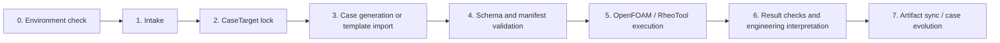

# Architecture

RheoFlow-Agent is organized as a validation-driven workflow around OpenFOAM and RheoTool. The project favors reproducible template import and explicit checks over unconstrained case-file generation.

## Seven-stage workflow

## Main components

| Component | Responsibility |
|---|---|
| Intake | Converts a business-language request into a structured requirement and decides whether more information is needed. |
| CaseTarget | Locks the runtime channel, OpenFOAM version, solver, and workflow family before execution. |
| Template matcher | Prefers certified tutorial or benchmark templates when the request matches a known case. |
| Case builder | Imports template files or generates dictionaries needed by the selected workflow. |
| Validator | Checks schema, manifest, solver selection, and basic consistency before running. |
| Runner | Executes OpenFOAM/RheoTool commands and records logs/artifacts. |
| Postprocessor | Extracts plots, metrics, reports, and domain-specific quantities. |
| Case curator | Checks whether a successful case is duplicate, reusable, or a candidate case asset. |

## Design principles

- Prefer certified templates over free-form generation.
- Keep physical assumptions explicit.
- Do not silently invent geometry, boundary conditions, or rheological parameters.
- Keep execution artifacts reproducible through manifests and logs.
- Treat case-library promotion as a human-reviewed action.
